# yumirror

局域网文件镜像与集中备份工具。**服务端**负责设备注册、消息转发和备份存储；**客户端**监听本地目录变化，把文件推给同组设备并留存服务端备份。两者都自带一个网页面板。

纯 Python 3.10+，无数据库，无外部服务依赖。

> **当前版本 v3.3.0-alpha1**（首个公开 alpha） · 作者 [@yuxiaole_awa](https://github.com/yuxiaole-bili) · 仓库 <https://github.com/yuxiaole-bili/yumirror>
>
> alpha 意味着接口和配置还可能变；本版已做过一轮安全性验证与真机攻防（87 项自动化测试 + 3 台 KVM 同网段攻防，见 [安全说明](#安全说明)）。

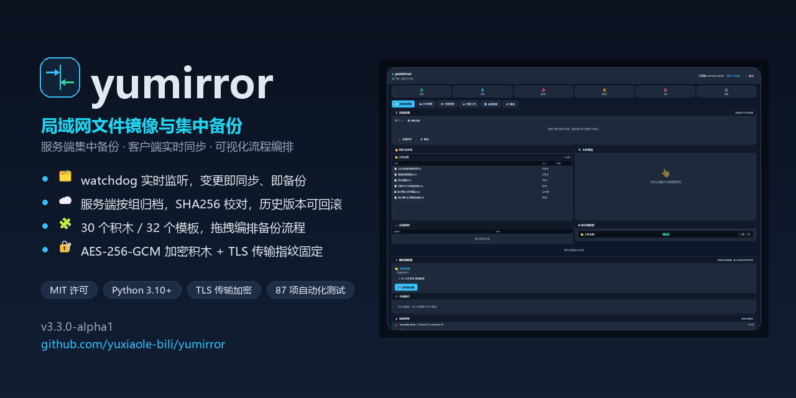

---

## 功能

- **自动同步**：客户端用 watchdog 监听目录，文件新建/修改/删除/重命名实时推给同组同伴
- **服务端集中备份**：客户端上传的文件按 `备份目录/<组名>/<相对路径>` 落盘，带 SHA256 记录
- **分组隔离**：不同 `group_id` 的客户端互不可见，同组内才转发
- **网页面板**：服务端面板看在线设备/备份/共享流程；客户端面板带文件浏览器、流程编辑器、工坊
- **备份流程编辑器**：网页面板里拖积木编排备份流程（30 个积木、**40 个开箱模板**），可试跑看每步输出，可绑定到目录自动触发
- **加密与版本**：文件级 AES-256-GCM 加密积木（服务端只存密文）；服务端保留历史版本，可列版本、打版本点、回滚、把旧版本取回本地
- **流程引擎**：可视化编排（条件、分支、循环、哈希校验、打包、清理、命令执行等积木），流程可在服务端工坊共享
- **心跳与自动重连**：服务端超时踢除僵死连接；客户端指数退避重连
- **传输加密**：TCP 走 TLS（服务端首启自动生成自签证书，客户端用 SHA256 指纹固定/TOFU 防中间人）
- **多语言**：面板支持中文 / English，浏览器语言自动识别 + 右下角切换；`/api/i18n` 把词条、积木与模板英文名一并给出去

## 架构

```
┌──────────────┐   TCP 9999（自定义 6 字节头协议）   ┌──────────────┐
│  客户端 A     │ ───────────────────────────────▶ │   服务端      │
│ watchdog 监听 │ ◀─────────────────────────────── │ 注册/转发/备份 │
│ Web 8087     │       同组转发 / 快照比对          │ Web 8086     │
└──────────────┘                                   └──────┬───────┘
        ▲                                                 │
        │            TCP 9999（同组才互通）                 ▼
┌──────────────┐                                   backups/<组>/<路径>
│  客户端 B     │ ◀────────── 镜像 / 哈希比对 ────────
└──────────────┘
```

| 端口 | 用途 |
|------|------|
| 9999 | 服务端 TCP 主端口（客户端连接、转发、备份上传） |
| 8086 | 服务端 Web 管理面板 |
| 8087 | 客户端 Web 面板（默认只绑 127.0.0.1） |

## 目录结构

```
establish/
├─ server/           服务端
│  ├─ server.py        主程序（TCP 服务 + TLS + Flask 面板 + 备份/版本管理）
│  ├─ config.example.json
│  └─ templates/dashboard.html   旧版独立面板页（当前面板为内联渲染，保留备查）
├─ client/           客户端
│  ├─ client.py        主程序（watchdog 同步 + Flask/socketio 面板）
│  ├─ seed_push.py     首次全量播种工具
│  ├─ config.example.json
│  └─ templates/       7 个页面模板（面板 / 流程编辑器 / 积木模式 / 资源管理器 / 工坊 / 登录）
├─ shared/           两端共用
│  ├─ protocol.py        消息类型与 TCP 帧封装
│  ├─ tls_util.py        传输层 TLS：自签证书生成、指纹固定（TOFU）
│  ├─ sync_core.py       目录扫描、哈希、文件收发
│  ├─ crypto_util.py     AES-256-GCM 分块加密容器（LMENC1）
│  ├─ backup_framework.py 流水线/日志框架
│  ├─ flow_engine.py     可视化流程引擎（30 积木 / 32 模板）
│  └─ ssh_tunnel.py      SSH 隧道工具（可选，未被主程序引用）
├─ scripts/          启动脚本（.bat / .sh）、demo_flows.py、gen_docs.py
├─ tests/            smoke_test.py（功能 50 项）、security_test.py（安全 37~38 项）
├─ docs/             流程积木参考.md（自动生成）、安全模型.md、界面截图
├─ .github/          issue / PR 模板
├─ requirements.txt / pyproject.toml / LICENSE / CHANGELOG.md
└─ SECURITY.md / CONTRIBUTING.md
```

`shared/` 必须和 `server/`、`client/` 同级 —— 两个主程序都靠 `sys.path` 里的上一级目录 `from shared.xxx import ...`。

## 文档

| 文档 | 内容 |
|---|---|
| [流程积木参考](docs/流程积木参考.md) | 30 个积木的参数表 + 40 个模板的步骤明细，含英文名（由 `scripts/gen_docs.py` 从引擎自动生成） |
| [安全模型](docs/安全模型.md) | 信任假设、防护与验证方式、明确不防的场景、部署加固清单 |
| [SECURITY.md](SECURITY.md) | 漏洞报告方式与已知不足 |
| [CONTRIBUTING.md](CONTRIBUTING.md) | 开发环境、测试、加积木的三处必改点、Python 3.10 兼容红线 |
| [CHANGELOG.md](CHANGELOG.md) | 每个版本改了什么，含真机攻防验证记录 |

仓库头像/图标用 `docs/screenshots/icon.png`（512×512）；面板与浏览器标签页的图标在
`client/static/`、`server/static/`（`favicon.svg` + `favicon.ico` + `apple-touch-icon.png`）。

## 快速开始

```bash
git clone <你的仓库地址>
cd <仓库目录>
python -m venv venv
venv\Scripts\activate          # Windows；Linux/macOS: source venv/bin/activate
pip install -r requirements.txt
```

### 1. 起服务端

```bash
copy server\config.example.json server\config.json     # Linux: cp
python server/server.py
```

浏览器打开 `http://<服务器IP>:8086` → 首次会跳到登录页 → 点「注册新账户」建一个管理员账户。
控制台会打印绑定地址、面板地址、备份目录。

也可以装成命令：`pip install -e .` 后执行 `yumirror-server`。

### 2. 起客户端

```bash
copy client\config.example.json client\config.json     # Linux: cp
# 编辑 client\config.json：改 server_host、client_id、group_id、sync_folders
python client/client.py
```

浏览器打开 `http://127.0.0.1:8087` 看客户端面板。

### 3. 首次全量播种（现在多数情况下不用手工做）

客户端每次连上服务端后会先做一次**备份对账**（`auto_backup_on_start`，默认开）：扫描同步目录、逐个与服务端备份哈希比对，缺少或不一致的就补传。所以启动前就存在的历史文件会在连上后自动补齐，不需要再手工播种。

想手工控制（例如目录特别大、或想只推某一个目录）：

```bash
python client/seed_push.py            # 推送 config.json 里所有 sync_folders
python client/seed_push.py 工作文档    # 只推指定 name 的文件夹
```

服务端按文件 mtime 判定「后写覆盖先写」，所以重复执行是安全的，不会用旧版本盖掉新备份。

## 配置说明

### server/config.json

| 键 | 默认 | 说明 |
|---|---|---|
| `server_name` | `yumirror-server` | 显示名（兼容旧键 `device_name`） |
| `bind_host` | `0.0.0.0` | TCP 监听地址 |
| `bind_port` | `9999` | TCP 端口（兼容旧键 `server_port` / `port`） |
| `web_host` / `web_port` | `0.0.0.0` / `8086` | 面板监听 |
| `backup_dir` | `server/backups` | 备份根目录，按 `<组>/<路径>` 存放 |
| `flows_share_dir` | `server/shared_flows` | 共享流程仓库 |
| `users_db_path` | `server/users.json` | 账户库 |
| `logs_dir` | `server/logs` | 日志目录（3.1.0 起可配置） |
| `max_clients_per_group` | `50` | 单组上限 |
| `heartbeat_interval` | `10` | 服务端发 PING 的间隔（秒） |
| `stats_interval` | `30` | 统计日志间隔（秒） |

空字符串视为「未设置」，回落内置默认值。配置文件带 BOM 也能读（3.1.0 起）。

### client/config.json

| 键 | 说明 |
|---|---|
| `client_id` | 设备名，同组内唯一；重复会用新连接顶掉旧连接 |
| `group_id` | 组名，只有同组设备互相转发 |
| `server_host` / `server_port` | 服务端 TCP 地址 |
| `server_web_port` | 服务端面板端口（客户端代理工坊请求用） |
| `web_host` / `web_port` | 本机面板监听，默认 `127.0.0.1:8087` |
| `sync_folders` | `[{"name": "工作文档", "path": "D:/Sync/work"}]`，**建议写绝对路径**（相对路径按启动时的工作目录解析） |
| `ignore_patterns` | 忽略规则，目录名/文件名/通配符均可，如 `node_modules`、`*.pyc`、`.git/*` |
| `account` | 填了就要求登录客户端面板；留空则面板无鉴权（见「安全说明」） |
| `auto_backup_on_start` | 默认 `true`：每次连上服务端后做一次**备份对账**，把本地缺少/变更的文件补传到服务端备份。用于兜住"监听就绪前、断线期间"漏掉的变化，也让历史文件自动补齐 |
| `max_reconcile_files` | 单次对账最多检查的文件数，默认 `2000`（大目录可调大，或关掉 `auto_backup_on_start` 用 `seed_push.py` 手工播种） |
| `heartbeat_interval` | 心跳间隔（秒），需小于服务端 60 秒的僵死判定 |
| `reconnect_base_delay` / `reconnect_max_delay` | 重连退避区间（秒） |
| `sync_groups` | 按文件夹的启停与绑定流程：`{"工作文档": {"enabled": true, "active_flow": ""}}` |
| `folder_triggers` | 目录事件触发流程的规则（面板里配置） |
| `ssh_tunnel` | 仅用于把面板请求指向本机隧道端口；隧道本身要自己建（`ssh -L`），默认 `enabled: false` |

## 备份流程编辑器

客户端面板右上角 **🧩 流程编辑器**（`http://127.0.0.1:8087/editor`），另有 **积木模式**（`/blocks`）和流程列表（`/flows`）。

### 三步上手

1. **选模板**：工具栏「模板」下拉按分类列出 29 个内置模板（备份 / 校验 / 同步 / 清理 / 通知 / 巡检 / 系统），选中即载入画布。
2. **试跑**：填好「试跑」输入框（文件夹名 = `sync_folders` 里的 `name`，相对路径 = 该目录下的文件），点 **🧪 测试**。右侧会显示逐行输出、失败行数，以及本次运行的全部变量；`upload_to_server` / `verify_backup` 会真的连服务端执行。
3. **保存 / 触发**：**💾 保存** 后可在面板里把它设为某个目录的流程或加触发器（定时 / 文件变更 / 手动）。

### 内置模板（重点：备份类）

| 模板 | 做什么 |
|---|---|
| ① 变更即备份 | 文件一改就上传服务端并校验哈希，失败分支给出明确原因 |
| ② 每日打包归档 | 整目录打包成带时间戳的 zip → 上传服务端 → 生成 Markdown 清单 |
| ③ 整目录批量备份 | 扫描目录后逐个文件上传（首次补齐历史文件，等价于 seed_push 的流程版） |
| ④ 备份清单报告 | 生成含 SHA256 的 MD+JSON 清单并上传留档 |
| ⑤ 备份并通知 | 备份校验后调 Webhook，成功发完成、失败发告警 |
| ⑥ 归档轮转清理 | 清理超过保留期的归档包，**默认只预演**，确认后关掉 `dry_run` |
| ⑦ 三方一致性守护 | 本地 / 服务端 / 同伴三处哈希比对，逐项给结论 |
| ⑧ 备份健康巡检 | 逐文件检查服务端是否已有同哈希备份，缺失项追加进报告文件 |

其余 21 个模板覆盖哈希校验、多目录同步、镜像一致性、同伴探测、Webhook 广播、命令巡检等。

### 备份积木（引擎里新增的 7 个）

| 积木 | 参数 | 作用 |
|---|---|---|
| ⬆ 上传备份到服务端 | `file_path` `remote_path` `result_var` | 真正把文件推进服务端备份目录（按 mtime 去重，重复跑不会破坏旧备份） |
| 🧾 校验备份一致 | `file_path` `remote_path` `result_var` | 本地 SHA256 vs 服务端备份，结果写布尔变量，可接分支 |
| 📄 复制/归档文件 | `src` `dst_dir` `overwrite` | 复制到归档目录 |
| 🗜 打包为 ZIP | `src` `zip_path` | 文件或目录打包（已存在则追加） |
| 📑 生成备份清单 | `dir` `pattern` `out_path` `format` | 输出 json / csv / md 清单（含 SHA256、大小、时间） |
| 🧹 清理过期文件 | `dir` `pattern` `days` `dry_run` | 删 N 天前的文件，`dry_run` 默认开 |
| 🔁 遍历列表 | `list_var` `item_var` `steps` | 对列表逐项跑子步骤；子步骤在属性面板里用 JSON 编辑 |

配合原有的 `scan_dir`、`get_file_hash`、`get_server_hash`、`get_peer_hash`、`compare`、`branch`、`write_file`、`http_request` 等，共 23 个积木。

### 常用变量

`{{_relpath}}` 相对路径 · `{{_full_path}}` 本地绝对路径 · `{{_folder}}` 所属同步目录名 · `{{_timestamp}}` 时间戳 · `{{_client_dir}}` 客户端目录（归档/清单默认落这里） · `{{_item}}` / `{{_item_path}}` / `{{_index}}` 遍历元素 · `{{_scan_count}}` 扫描结果数 · `{{_upload_ok}}` `{{_verify_ok}}` `{{_foreach_ok}}` / `{{_foreach_total}}` 结果

> 模板里的 `@folder:{{_folder}}` 会跟随当前事件所属的同步目录，所以换目录名不用改流程。

## 多语言

面板支持 **简体中文 / English**，右下角有语言切换器（选择存在 cookie 里，下次打开还是那个语言）。
首次访问跟随浏览器 `Accept-Language`；也可以在配置里钉死：

```json
// client/config.json 或 server/config.json
"language": "en-US"      // 留空 = 跟随浏览器
```

**语言包接口**（面板前端、脚本、第三方都能用）：

```bash
curl 'http://127.0.0.1:8087/api/i18n?lang=en-US'
```

```jsonc
{
  "status": "ok",
  "lang": "en-US",
  "langs": { "zh-CN": "简体中文", "en-US": "English" },
  "strings": { "nav_files": "Files", "btn_full_sync": "Full sync", ... },   // 界面词条
  "text_map": { "文件管理": "Files", ... },                                  // 中文原文 → 译文（前端兜底匹配用）
  "categories": { "备份": "Backup", ... },                                  // 模板分类
  "blocks": { "encrypt_file": { "label": "Encrypt file", "description": "..." }, ... },   // 30 个积木
  "templates": { "encrypted_backup": { "name": "⑨ Encrypted backup", ... }, ... }         // 32 个模板
}
```

语言代码很宽松：`en` / `en_US` / `EN-us` 都能识别，不支持的语言回退到 `zh-CN`。

覆盖范围（说实话）：
- ✅ 面板静态文案（导航、区块标题、按钮、表头、空态、登录页、接口报错消息）——非中文界面下按"中文原文 → 译文"精确匹配替换，
  所以新增静态文案只要加词条就自动生效；
- ✅ 积木与模板的英文名/说明、模板分类（`/api/i18n` 与 `docs/流程积木参考.md` 都能看到）；
- ⚠️ **由 JS 动态渲染**的片段（设备卡按钮、部分表格行、toast 提示）还没接：需要把中文换成 `YM_T('key')`
  （脚本已注入 `window.YM_T`）。做法见 [CONTRIBUTING.md](CONTRIBUTING.md)；
- ⚠️ 日志、流程步骤、文件内容属于运行时数据，不翻译。

加词条的规矩：`shared/i18n.py` 里 `zh-CN` 与 `en-US` 必须**键完全一致**，
`tests/smoke_test.py` 的 [6] 段会做奇偶校验（漏翻一条就测试失败），积木/模板英文名缺失同样会被抓出来。

## 加密与版本（也是流程积木）

这两件事都能编进备份流程，不是只能靠配置开关。

### 加密积木

| 积木 | 参数 | 说明 |
|---|---|---|
| 🔐 加密文件 | `file_path` `passphrase_secret` `key_file` `out_path` `delete_source` | AES-256-GCM **分块**加密，输出 `LMENC1` 容器；改一个字节就解不开（GCM 认证标签） |
| 🔓 解密文件 | 同上 | 解密 `.enc`；口令错/被篡改直接报错，不会给出半个坏文件 |
| 🗝 生成密钥文件 | `path` `overwrite` | 生成 32 字节随机密钥（十六进制文本，0600 权限） |

**密钥怎么给**（重要）：口令**不写进流程文件**，而是放在客户端配置里，积木用名字去取：

```json
// client/config.json
"backup_passphrase": "你的口令",
"backup_key_file": "D:/keys/mirror.key"
```

积木的 `passphrase_secret` 默认值就是 `backup_passphrase`（**只传名字，口令不进 vars、不进日志、不进接口回显**）；
`key_file` 直接填 `{{_backup_key_file}}` 就会用配置里的密钥文件。两者给一个即可。

加密后服务端只拿到密文，典型用法是「先加密 → 再上传 → 打版本点」，见模板 **⑨ 加密备份**。

### 版本与回滚积木

服务端为每个文件保留历史版本（覆盖前自动归档，目录在 `<备份目录>/<组>/.versions/<路径>/`，不会混进备份列表）：

| 积木 | 参数 | 说明 |
|---|---|---|
| 🕘 列出版本 | `file_path` | 列出历史版本与当前版本；结果变量是数组，`_version_count` 是数量 |
| 🔖 打版本点 | `file_path` `reason` | 把当前备份原样归档成一个带标记的版本（内容没变也能留点） |
| ⏪ 服务端回滚 | `file_path` `version` | 回滚到 `latest` / `latest-2` / 具体版本号；**回滚前会把当前内容自动留档，所以能再回滚撤销** |
| 📥 取回旧版本 | `file_path` `version` `out_path` | 把某个历史版本取回本地（默认写客户端 `restored/`），并校验 SHA256 |

保留数量由服务端 `max_versions_per_file` 控制（默认 20，0 = 不留）。配套模板：**⑩ 一键回滚上一版**、**⑪ 版本巡检**。

> 取回积木单次上限 16MB（走一条响应，避免把大文件塞进内存）；更大的版本请直接从服务端备份目录取。

## 测试

```bash
python tests/smoke_test.py       # 功能冒烟：61 项，加 -k 保留临时目录
python tests/security_test.py    # 安全性攻防：37 项，加 -k 保留临时目录
python tests/template_test.py    # 模板验收：起真服务端+真客户端，把模板逐个真跑一遍
python scripts/gen_docs.py --check   # 文档是否与引擎同步
```

`template_test.py` 是**验收**而不是"能不能加载"：它起真服务端 + 真客户端 + 真文件，
把每个模板执行一遍并检查日志里有没有 ❌；需要第二个客户端（同伴）或真实外网 webhook 的模板会标为 SKIP 单独统计。

**模板验收**：27 个可在单机环境执行的模板 **27/27 通过**（13 个需要同伴/外网的标为 SKIP）。

**功能（61 项，含兼容性静态检查与多语言）**：配置键别名、备份防覆盖、**版本化存储与回滚（含回滚可撤销、保留上限、.versions 不混入备份列表）**、忽略规则、暂停期事件补发、
端到端（起服务端+客户端→建文件→校验服务端备份 SHA256）、启动对账、播种工具、
**流程编辑器（模板目录、两个编辑器的积木覆盖率、队列流程步骤数、备份流程真的把文件上传到服务端且哈希一致）**、
**版本/加密积木（列版本、回滚、取回、加密上传后服务端只有密文且不含明文）**、面板可达性、未登录访问管理接口返回 401。

**安全（37 项）**：未登录读写管理接口/设备列表/状态、未登录注入与删除共享方案、未登录面板首页、
默认禁止命令执行积木（并验证显式开启后仍可用）、文件 API 读写删越界（含 Windows 反斜杠）、
裸协议 `FILE_CREATE` 路径穿越与组名穿越、版本号穿越、口令存储强度、两个面板的内联 JS 转义。

**多语言（11 项）**：两个语言词条对齐、积木/模板/分类英文名齐全、`/api/i18n` 四种语言入参
（正常 / 别名 / 不支持 / 无参数协商）、页面注入语言脚本与切换器。

**安全（37 项）里还包含**：明文连接无法进入应用层、TOFU 指纹自动固定、指纹不匹配拒绝连接、
登录失败限速 429、两个面板的安全响应头。

两套都在临时目录里跑，不碰你的真实配置和备份，退出码非 0 表示有失败项（可直接用于 CI）。

## 界面预览

> 下面这些是**实机截图**：服务端跑在一台真实 Linux 主机上，客户端是本机 Windows，
> 两者经局域网（SSH 隧道转发端口）连接，**TLS 已连接且指纹已固定**。

| 客户端面板（已连接 yumirror-server · 真实文件与事件） | 文件浏览器 |
|---|---|
| 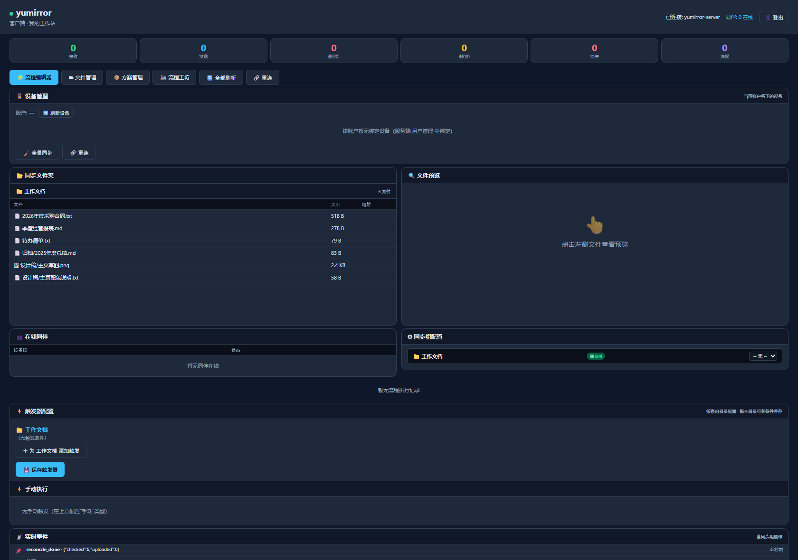 | 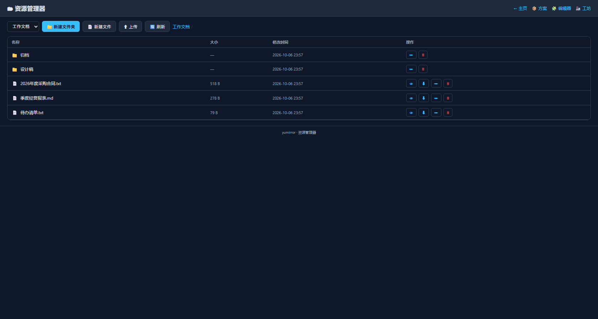 |

| 流程编辑器（载入「⑨ 加密备份」模板） | 工坊（服务端共享方案） |
|---|---|
| 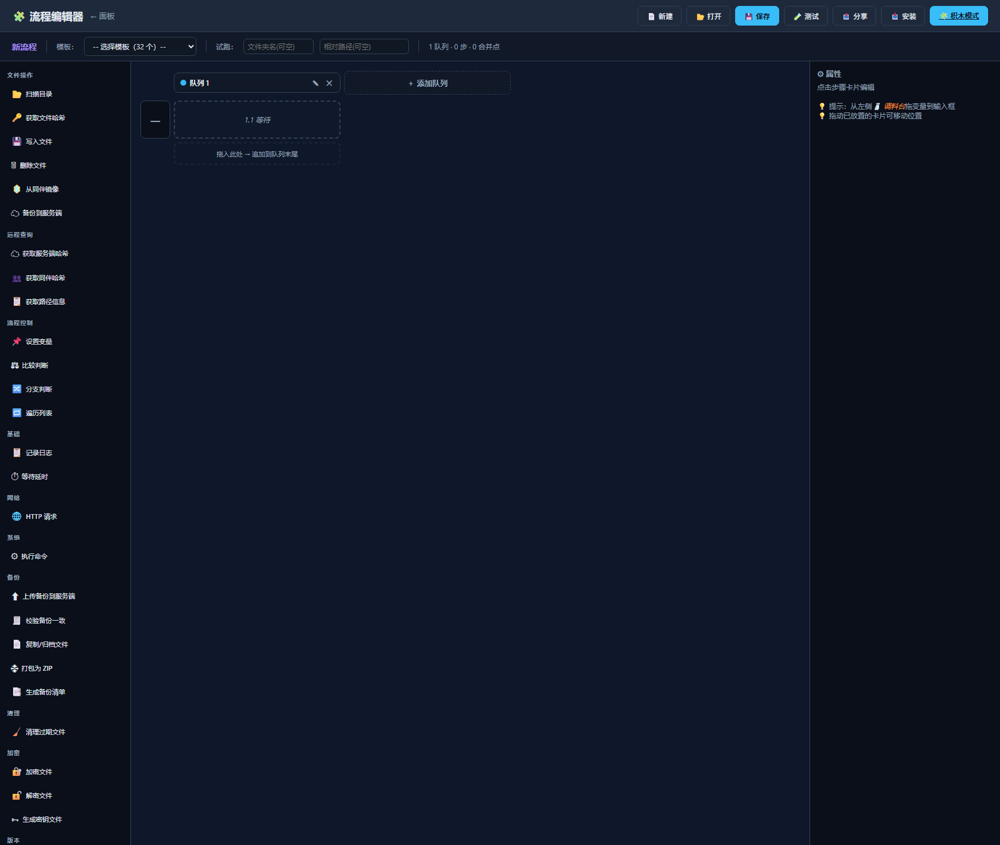 | 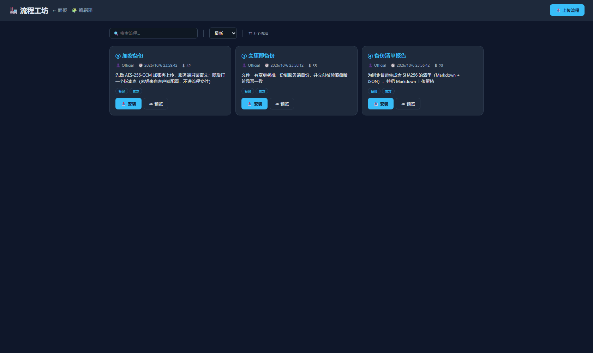 |

| 服务端登录页（经 SSH 隧道访问真机） | 一键演示的真实运行输出 |
|---|---|
| 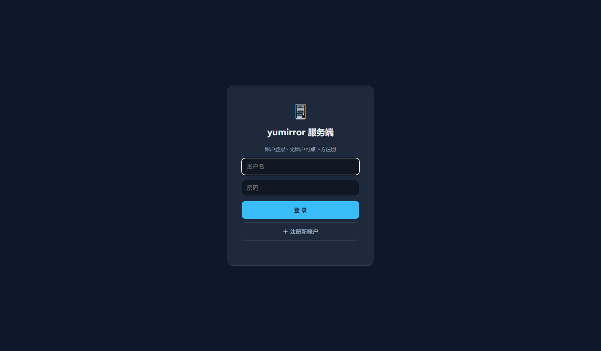 | 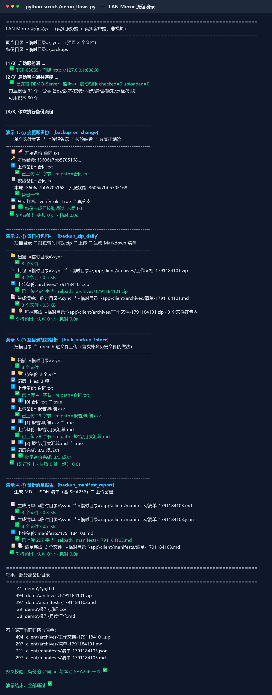 |

能力一览（适合直接拿去当宣传图）：

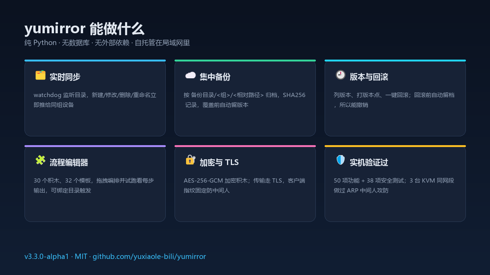

早期在演示环境里截的那批（`01-`～`06-`）仍在 `docs/screenshots/` 里，可作对照。

### 编辑工作流 / 同步过程演示

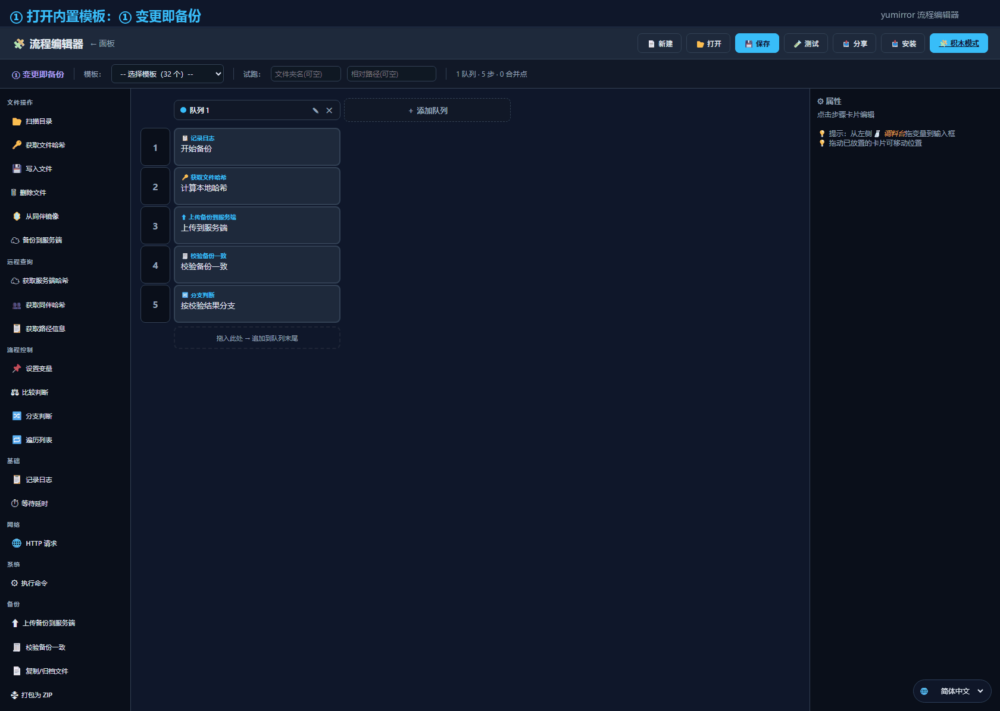

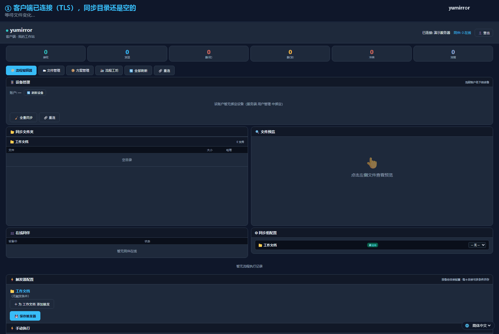

### 流程演示动画

工坊里点任意方案的**预览**，会播放一段模拟动画：设备节点、飞行的数据包、逐站进度、每步播报与文件进出。
也可以直接深链打开并自动播放：`/workshop?preview=<方案id>&autoplay=1`

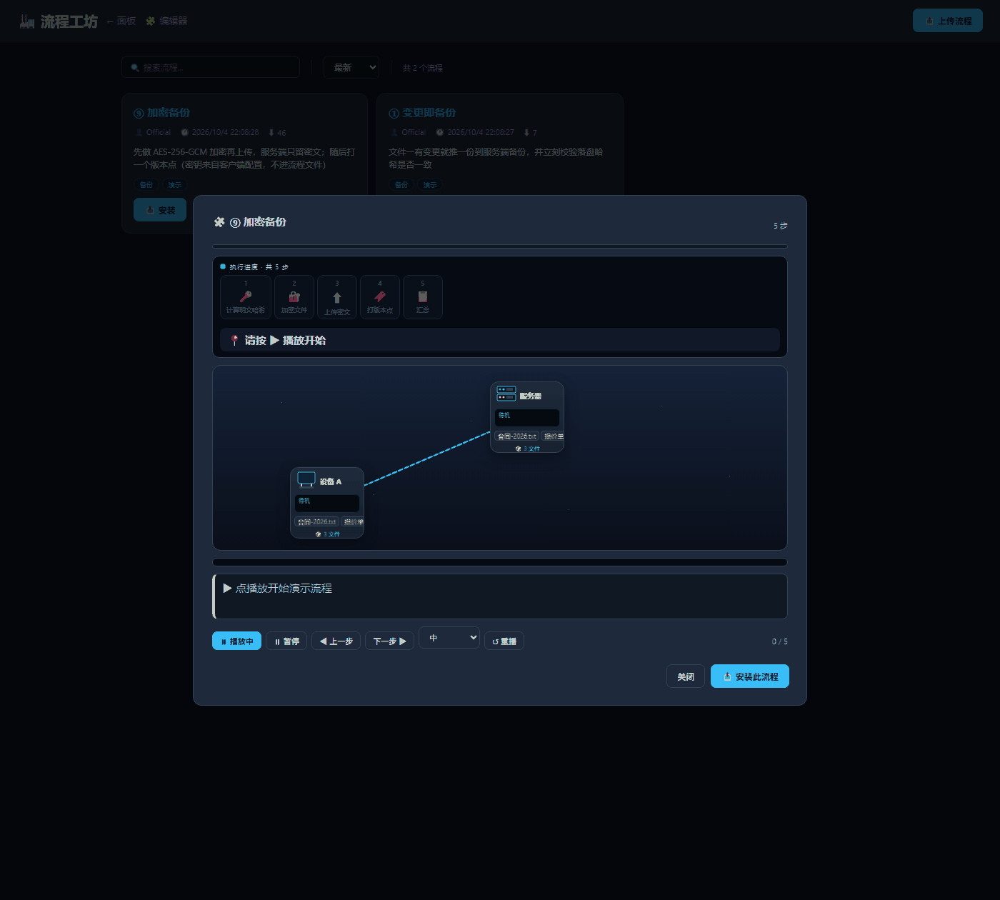

| 第 1 步：计算明文哈希 | 第 3 步：上传密文（数据包飞向服务器） | 第 5 步：汇总完成 |
|---|---|---|
|  | 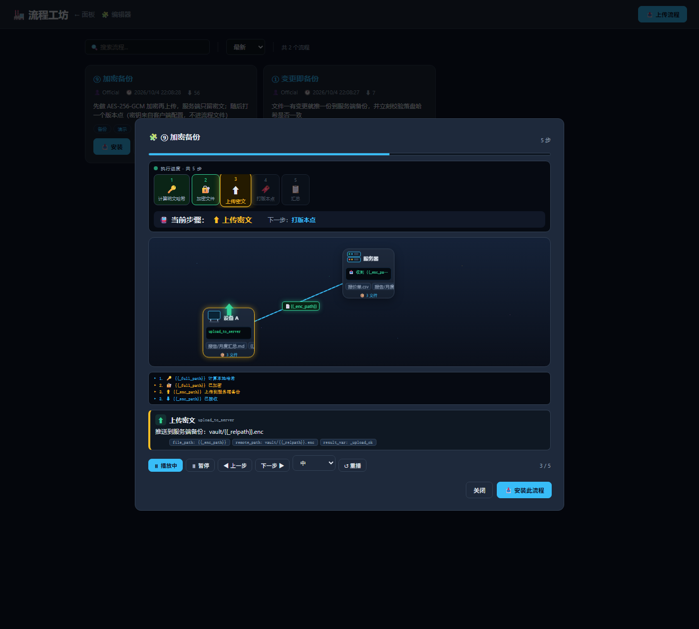 | 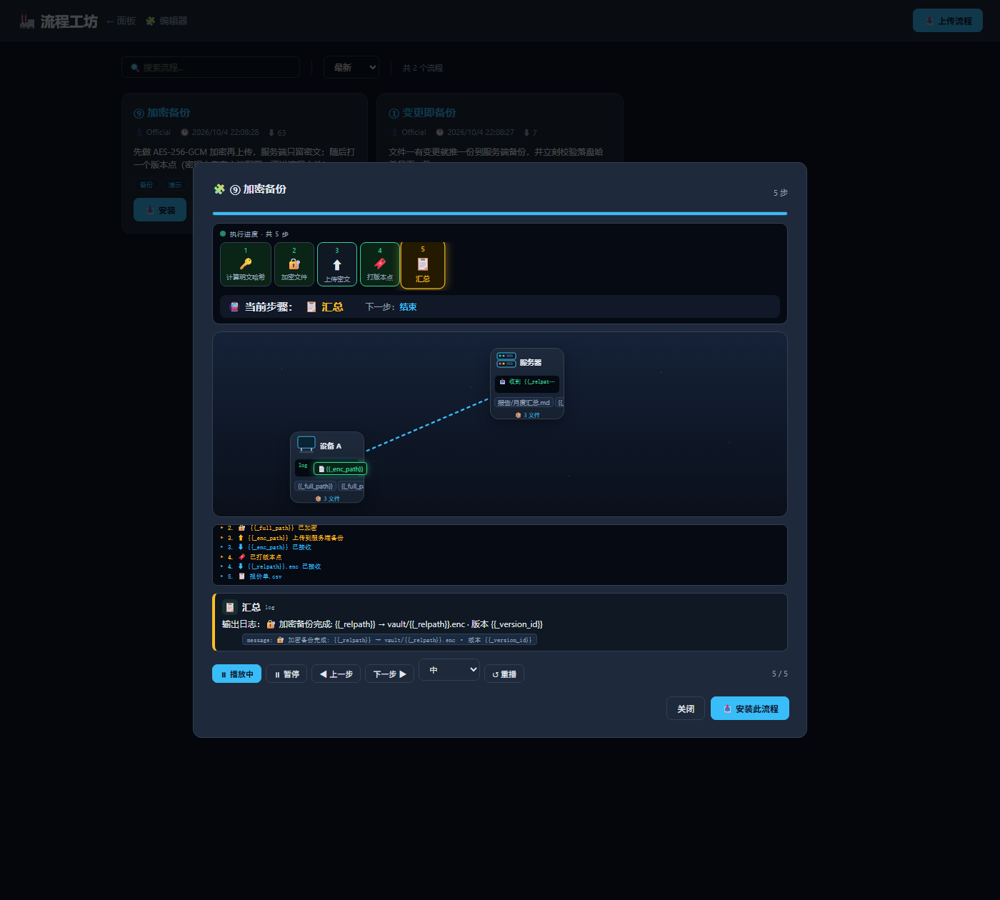 |

## 一键演示

```bash
python scripts/demo_flows.py          # 真起服务端+客户端，依次跑 4 个备份模板并打印每步输出
python scripts/demo_flows.py 1 3      # 只跑第 1、3 个
```

## 已知限制

- **对账有上限**：单次对账默认最多检查 2000 个文件（`max_reconcile_files`），超出部分留给下一轮或 `seed_push.py`。
- **客户端面板无鉴权（默认）**：`account` 留空时任何能访问 8087 端口的人都能浏览/下载/删除同步目录里的文件；**但「执行命令」积木默认禁用**，要开给局域网请设 `account`（面板改为需登录）。
- **证书是自签的**：客户端靠"首次连接记住指纹"（TOFU）认服务端，不做 CA 链校验。换证书后需要清空客户端 `tls.fingerprint` 重新固定。
- **网页面板默认仍是 http**：TCP 已经加密，但面板需要显式打开 `panel_tls`（面板只绑 `127.0.0.1` 时影响不大）。
- **单客户端单连接**：客户端与同组镜像、RPC 查询共用一条 TCP 连接。接收侧已加锁并把 RPC 响应交回等待方；发送侧仍未串行化。
- `shared/ssh_tunnel.py` 未被主程序引用，属预留模块。
- `shared/protocol.py` 里的 `FILE_END` 目前未被发送，传输以空 `FILE_DATA` 作为结束标记。

## 安全说明

这是一个**面向可信局域网**的工具，请不要直接暴露到公网。已经做到的防护（每一条都有测试守着，见 `tests/security_test.py`）：

| 面 | 防护 |
|---|---|
| 服务端管理接口 | `/api/admin/*`、设备/组/状态/备份清单、面板首页均需登录会话或 `X-Auth-Token`；未登录一律 401 / 跳 `/login` |
| 共享方案库 | 读（列出/下载）开放，**写（上传/删除）必须登录**，避免匿名者投毒 |
| 账户口令 | PBKDF2-HMAC-SHA256（12 万次迭代 + 每账户随机盐）；旧的无盐 SHA-256 在登录成功时自动升级 |
| 客户端面板 | 「执行命令」积木**默认禁用**，需 `allow_command_block: true` 显式开启；文件 API 用 `commonpath` 限制在同步目录内 |
| 备份存储 | 组名与相对路径净化、`commonpath` 校验，穿越写不出备份根目录 |
| 面板输出 | 文件名/用户名进内联 JS 前做 JS 字符串转义（`jsq`），阻断"投毒文件名 → 管理员面板 XSS"链路 |
| **组密钥** | 服务端 `group_keys: {"组名": "密钥"}` + 客户端 `group_key`：配了密钥的组，**不知道密钥就无法入组**，阻断"知道组名就能往别人同步目录写文件"的盲注。不配则行为不变（向后兼容） |
| **传输层 TLS** | 默认开启：服务端首启自动生成自签证书并打印 SHA256 指纹，客户端连接时**自动固定**该指纹（TOFU），之后指纹变了就拒绝连接（防中间人）；不设置 `tls.enabled=false` 就只能是 TLS 连接，明文客户端连应用层都进不去 |
| **面板加固** | 安全响应头（nosniff / X-Frame-Options / CSP / Referrer-Policy）、`/api/*` 不缓存、登录失败 5 次锁 5 分钟（429）；可选 `panel_tls` 让面板走 https |

**仍未做**：CA 签发的证书（只支持自签 + 指纹固定）、面板 TLS 默认关闭、限速状态不持久化（重启即清）、公网暴露场景下的加固。

> ⚠️ 组密钥是**缓解不是根治**：密钥在 HELLO 里发送，而 HELLO 现在跑在 TLS 里，所以嗅探者拿不到它了；
> 但如果攻击者能拿到客户端配置或证书指纹被绕过，风险仍在。多层配合使用更稳。

建议：
1. 用防火墙把 9999/8086/8087 限制在可信网段，或通过 SSH 隧道访问面板；
2. 客户端面板保持默认只绑 `127.0.0.1`，要开放就先配 `account`；
3. 同组的机器互相信任，**别把组名/组密钥告诉不该给的人**，并给组配上 `group_key`；
4. 需要保密的文件用加密积木先加密再同步/上传（内容加密，**但文件名等元数据仍是明文**）；
5. 从工坊安装别人的流程前看一眼步骤，尤其是「执行命令」「HTTP 请求」；
6. 备份目录、`server/users.json`、`server/workshop.json` 属运行数据，已在 `.gitignore` 中排除，不要提交。

发现问题请开 issue（安全类请勿公开细节，先私下联系仓库作者）。

### 实机攻防验证（3 台 KVM）

除自带的 26 项安全测试外，本版还在 3 台虚拟机上做过**真网络攻防**（同一二层网段：服务端 / 客户端 / 攻击机）：

| 轮次 | 攻击 | 结果 |
|---|---|---|
| 1 | 攻击机 ARP 双向欺骗做中间人 + tcpdump | 加固前：**抓到明文文件内容**（命中 6 次）与 `relpath`/`sha256` 元数据；**加固后（TLS）：明文 0 命中、协议字段 0 命中** |
| 2 | 从另一台机器打面板与协议 | 未登录管理接口全 401、面板首页 302、方案库写入 401；客户端面板默认不对外 |
| 3 | 无凭证用 `group_id` 入组并注入文件 | **成功写进受害者同步目录** → 已修（组密钥） |
| 4 | 加固后复攻 | 加密积木：链路上只剩 `LMENC1` 密文；组密钥：无密钥入组被拒 `status=rejected`；**TLS：攻击机明文注入直接 `ConnectionResetError`，服务端记 `TLS 握手未完成 · SSLError`** |

顺带在 Python 3.10（Ubuntu 22.04）上发现并修掉了一个**启动即崩**的兼容性 bug（`client.py` 漏 import `Optional`，
在 3.14 上因注解延迟求值而侥幸能跑），并加了静态检查防回归。

## 许可

MIT，见 [LICENSE](LICENSE)。
